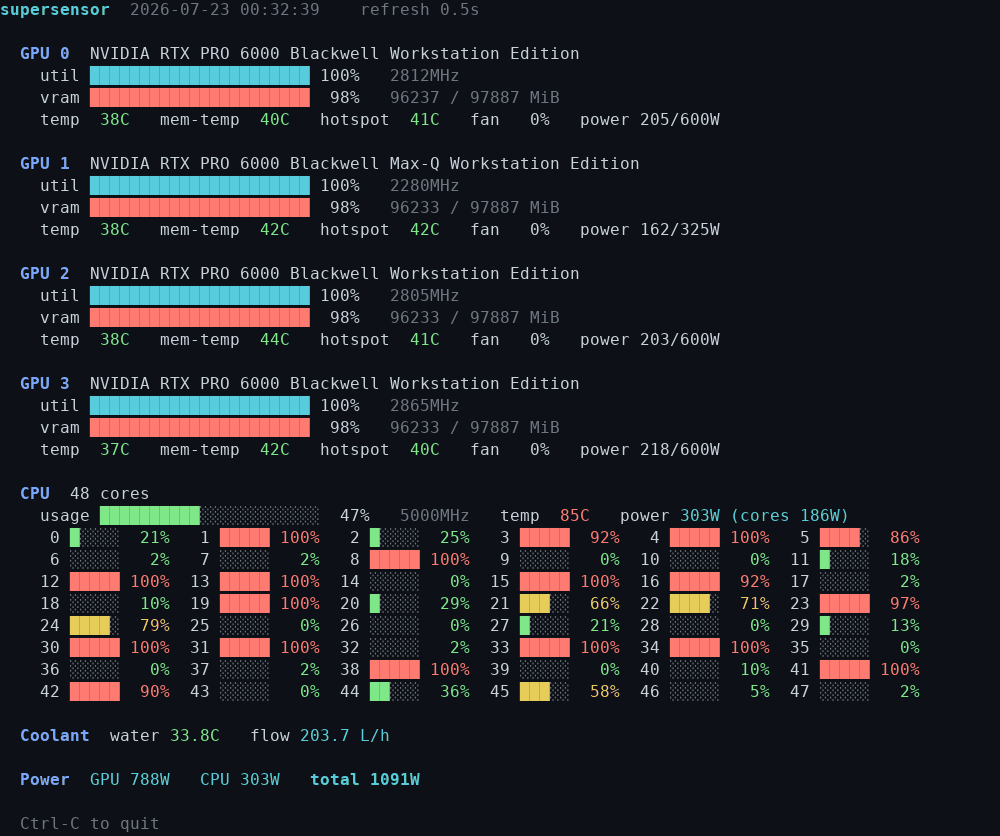

# supersensor

A mini-[nvtop](https://github.com/Syllo/nvtop)-style **live terminal monitor** that puts your
GPUs, CPU, and liquid-cooling loop on one screen — including sensors the usual tools can't reach
(GPU **memory** temps on Blackwell, CPU **package power**, coolant **temp + flow**).

It's a single dependency-free Python script (stdlib only) and **degrades gracefully**: every data
source is optional, and anything unsupported on your machine simply shows `n/a` instead of failing.



*Four GPUs under a live vLLM workload while a CPU load ramps across all cores. Values are
color-coded by load/temperature (green → yellow → red); each GPU shows core/memory/hot-spot temps
and power, the CPU shows aggregate + per-core usage, and the loop shows coolant temp + flow.*

## What it shows

- **Per GPU** — name, utilization, SM clock, VRAM used/total, **core temp**, **memory temp**,
  **hot spot**, fan %, power draw/limit.
- **CPU** — aggregate usage, average frequency, package temp, **package power** (+ core power),
  and a **per-core usage grid** (index · bar · %).
- **Coolant** — water temperature and flow rate (L/h), if a supported loop sensor is present.
- **Total power** — sum of GPU board power + CPU package power.

## Requirements

- **Python 3.6+** — standard library only, nothing to `pip install`.
- Everything below is **optional**; supersensor uses whatever is available:

| Source | Provides | Needs | If unavailable |
|---|---|---|---|
| `nvidia-smi` | GPU util, VRAM, core temp, power, fan, clock | NVIDIA driver | GPU section shows "no GPUs" |
| [`nvidia-gpu-sensors`](https://github.com/philipl/nvidia-gpu-sensors) | GPU **memory** & **hot-spot** temp | binary + root | those columns show `n/a` (nvidia-smi's mem temp still used if it has one) |
| `turbostat` | CPU **package**/core power, avg freq | `turbostat` + root + MSR | falls back to RAPL |
| RAPL (`/sys/class/powercap`) | CPU package power | powercap + root | power shows `n/a` |
| `/proc/stat` | CPU usage (aggregate + per-core) | Linux | usage shows `n/a` |
| hwmon (`/sys/class/hwmon`) | CPU package temp | `lm-sensors`/kernel | temp shows `n/a` |
| Aquacomputer `highflownext` | coolant temp + flow | `aquacomputer` kernel module | Coolant section is hidden |

## Install

```sh
make install                 # -> /usr/local/bin/supersensor
make install-gpu-sensors     # optional: nvidia-gpu-sensors -> /usr/local/bin (see below)
```

Override the location with `PREFIX=` or `BINDIR=` (e.g. `make install PREFIX=$HOME/.local`).
`make uninstall` removes it. Installing copies the script, so re-run `make install` after edits.

## Usage

```sh
sudo supersensor              # full data (package power + GPU mem temps need root)
supersensor                   # works too — those root-only sources show n/a
supersensor --interval 2      # refresh every 2s (default 1s)
supersensor --once            # print a single frame and exit (good for logs/pipes)
supersensor --no-color        # plain text
supersensor --gpu-sensors /path/to/nvidia-gpu-sensors
```

You can also run it without installing: `make monitor` (= `sudo python3 supersensor.py`), or
directly with `python3 supersensor.py`.

### Why sudo?

CPU package power (turbostat reads MSRs; RAPL's `energy_uj` is root-only since CVE-2020-8694) and
GPU memory/hot-spot temps (`nvidia-gpu-sensors` reads the card's BAR0) both require root. Run
`sudo supersensor` for the full picture; everything else — GPU stats, CPU usage, coolant — works
unprivileged.

## GPU memory & hot-spot temps

`nvidia-smi` reports `temperature.memory` as `N/A` on many cards (e.g. RTX PRO 6000 Blackwell).
[`nvidia-gpu-sensors`](https://github.com/philipl/nvidia-gpu-sensors) reads it straight off the die:

```sh
sudo apt install -y git build-essential meson ninja-build
git clone https://github.com/philipl/nvidia-gpu-sensors && cd nvidia-gpu-sensors
meson setup build && ninja -C build
```

supersensor auto-detects the binary via `$PATH`, `$SUPERSENSOR_GPU_SENSORS`,
`~/nvidia-gpu-sensors/build/`, and `/usr/local/bin`. Run `make install-gpu-sensors` (from the repo
root, with the build present) to copy it onto `$PATH` for good.

If **hot spot** shows `n/a` with a note about `mmap of BAR0`, your kernel has
`CONFIG_IO_STRICT_DEVMEM=y`; boot with `iomem=relaxed` on the kernel command line to enable it.
(Core and memory temps do not need this.)

**Build an up-to-date `nvidia-gpu-sensors`.** Builds before the
`Core Temp | Hot Spot | Mem Temp` column order print a header that disagrees with the data they
emit, transposing memory and hot spot. supersensor detects that (hot spot can never read below
core temp) and corrects it, but a current build avoids the guesswork.

**Memory and hot spot are matched to GPUs by a learned map.** `nvidia-gpu-sensors`
enumerates GPUs via RM's `GPU_GET_PROBED_IDS` and prints no PCI bus id, so its row numbers are
not nvidia-smi's indices and cannot be joined directly -- on a 4x RTX PRO 6000 host here its row
2 is nvidia-smi's GPU 1. Joining by index shows one card's memory temperature against another.

supersensor matches rows to GPUs by core temperature, which both report. That identifies a card
only while it sits at a temperature no other card shares, so each sample pins whichever cards it
can, the result accumulates in `~/.cache/supersensor/rowmap.json` keyed by the set of PCI bus ids
present, and the last row falls out by elimination. Until a card is recognised its memory and hot
spot read `n/a`; once the map is complete it is reused even when every card is idle and
indistinguishable. A reading that contradicts the map -- cards moved between slots -- discards it
and relearns.

Uneven load during ordinary use fills the map in on its own; each GPU only has to be busier than
the others once. On startup supersensor also tries to force it, loading each unrecognised GPU
briefly via `stress.py`, which needs a CUDA-capable torch on the monitoring host -- often absent
even on a machine that runs GPUs, in which case it says so and falls back to learning passively.
`--no-autolearn` skips that entirely; `$SUPERSENSOR_STATE` relocates the cache.

Note that a `sudo supersensor` run creates the cache directory; it is handed back to the invoking
user so later unprivileged runs can still write it.

## CPU package power

Best data comes from `turbostat` (part of `linux-cpupower` / `linux-tools`); supersensor streams it
in the background and shows `PkgWatt`, `CorWatt`, and `Bzy_MHz`. If turbostat isn't installed it
falls back to RAPL powercap counters, and if neither is readable, power shows `n/a`. CPU **usage**
(aggregate and per-core) comes from `/proc/stat` and needs no privileges.

## Coolant loop

Water temperature and flow are read from the kernel `aquacomputer` hwmon driver
(Aquacomputer **High Flow Next**: coolant temp + flow in dL/h, converted to L/h). If no such sensor
is present the Coolant section is simply omitted.

---

## GPU stress test (secondary)

The repo also ships a small CUDA burn-in used to exercise the GPUs while you watch temps in
supersensor. It's a Dockerized PyTorch fp16 matmul loop with built-in temp sampling (`stress.py`).

```sh
make build                          # build the image (nvcr.io/nvidia/pytorch base)
make run                            # stress ALL GPUs for 5 min
make run TIMEOUT=600 GPUS='"device=0,1"'
make run ARGS="--size 8192 --interval 2"
```

Run it in one terminal and `sudo supersensor` in another to watch the loop heat up.

## Project layout

| File | Role |
|---|---|
| `supersensor.py` | **the monitor** (primary) — single-file, stdlib only |
| `stress.py` | GPU stress test (secondary) |
| `Makefile` | `install` / `monitor` (supersensor) and `build` / `run` (stress test) |
| `Dockerfile` | image for the stress test |
